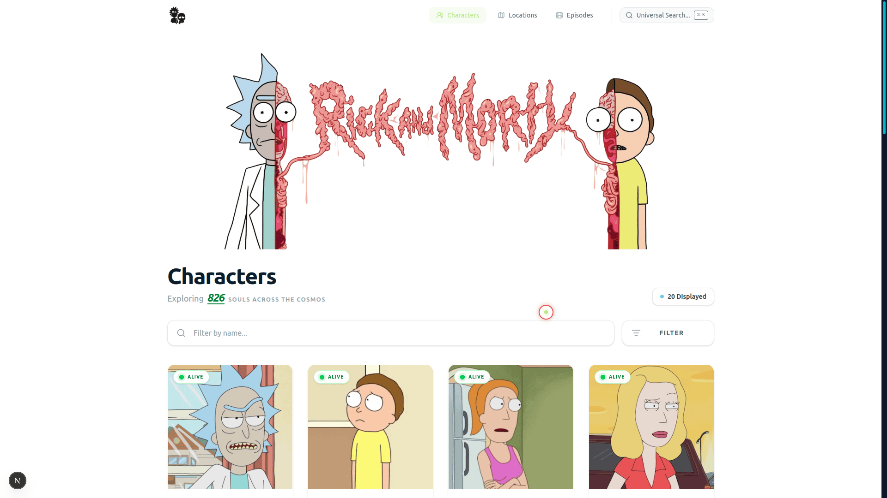

# 🧪 Rick & Morty Wiki

> An interdimensional database for exploring characters, locations, and episodes from the Rick and Morty universe. Built with performance, scalability, and clean architecture in mind.

[](https://YOUR_DEPLOY_LINK_HERE)
[](https://opensource.org/licenses/MIT)**🔗 Live Demo:** [https://](https://)



## 🚀 Features

- **Multiverse Explorer:** Browse detailed lists of Characters, Locations, and Episodes.
- **Deep Linking:** Fully interconnected data. Navigate from a Character to their Origin Location, or see all Characters in a specific Episode.
- **Advanced Filtering:** Filter by status, species, gender, type, and dimension.
- **URL Synchronization:** All search and filter states are synced to the URL (`useUrlSync`), allowing users to share exact search results.
- **Infinite Scrolling:** Seamless pagination powered by **TanStack Query**.
- **Dark Mode:** Fully responsive Light/Dark themes using `next-themes`.
- **Responsive Design:** Mobile-first layout with a custom navigation drawer and grid system.

## 🛠️ Tech Stack

- **Framework:** [Next.js](https://nextjs.org/) (React)
- **Language:** [TypeScript](https://www.typescriptlang.org/)
- **Styling:** [Tailwind CSS](https://tailwindcss.com/)
- **State & Data Fetching:** [TanStack Query (React Query)](https://tanstack.com/query/latest)
- **Icons:** [Lucide React](https://lucide.dev/)
- **API:** [The Rick and Morty API](https://rickandmortyapi.com/)

## 🏗️ Architecture & Design Patterns

This project follows a modular, feature-based architecture to ensure maintainability and scalability.

### 1. Centralized API Layer

All data fetching logic is encapsulated in `src/lib/api-client.ts`. This provides a type-safe, consistent interface for the entire application and handles 404/Error states globally.

### 2. Custom Hooks

Logic is extracted into reusable hooks to keep components clean:

- **`useUrlSync`**: A powerful hook that manages the two-way binding between the UI (Search Bar/Filters) and the URL Query Parameters.
- **`useCharacters` / `useLocations` / `useEpisodes`**: Specialized hooks wrapping React Query's `useInfiniteQuery` for data fetching and caching.

### 3. Component Design System

A set of atomic, shared components ensures UI consistency:

- **`BaseCard`**: Handles hover effects, shadows, and theme colors (Green for Characters, Blue for Locations, Orange for Episodes).
- **`ResourcePageLayout`**: A higher-order layout component that standardizes the header, search bar, grid, and loading states across all list pages.
- **`EmptyState` / `NotFoundState`**: Standardized UI for error handling.

## 📂 Project Structure

```bash
src/
├── components/
│   ├── character/    # Character-specific components (Card, Detail)
│   ├── episode/      # Episode-specific components
│   ├── location/     # Location-specific components
│   └── shared/       # Reusable UI (Button, Modal, Loader, etc.)
├── hooks/            # Custom logic (useUrlSync, useDebounce)
├── lib/              # API client and singletons
├── pages/            # Next.js routes
├── styles/           # Tailwind and Global CSS
└── types/            # Centralized TypeScript definitions
```
